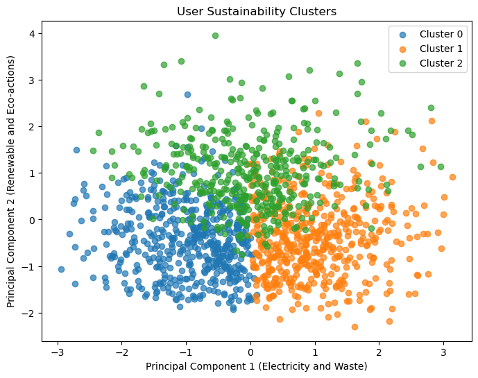
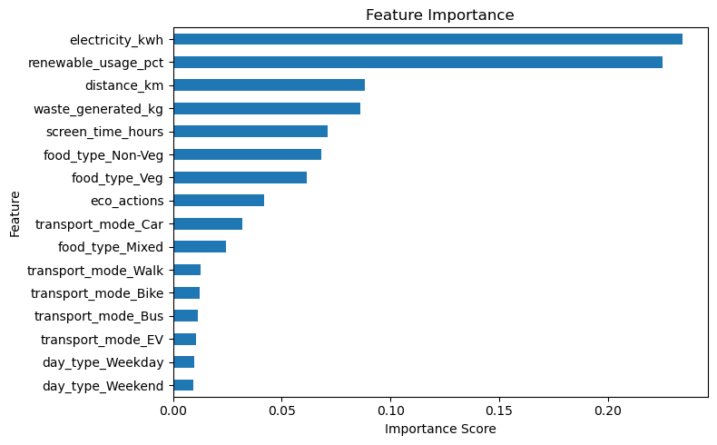
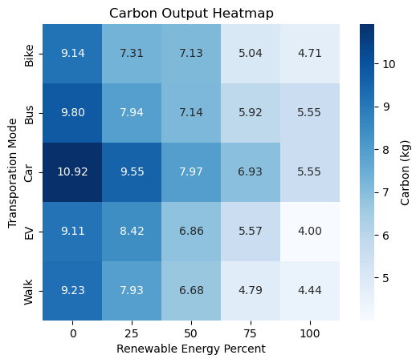
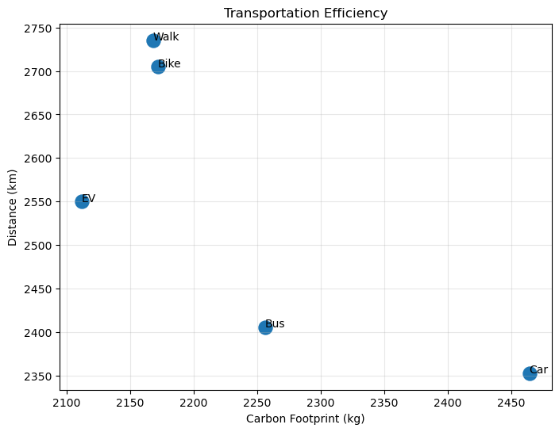

Personal Carbon Footprint Analysis and Recommendation System

This proeject combines data cleaning, exploratory data analysis, visualations, machine learning, clustering, and a recommendation system to discover behaviors that contribute heavily to personal carbon footprints.

Using over 1,000 instances of user data, this project discovers the strongest factors of carbon footprint, predicts future footprints using machine learning and clustering to group similar users, and generates ways to reduce carbon output. This model also predicts what a reduction in carbon output may look like based on those recommendations.

Developed using ideas learned over the last three years studying Data Science and Astronomy at the University of Illinois Urbana-Champaign, as well as self-learning.

Key Findings:

- Energy usage was was on the strongest predictors of carbon footprint followed by waste and distance traveled.
- Renewable energy usage was associated with a significant decrease in carbon emission.
- Clustering users within this dataset revelated different footprint behaviors.
- With slight alterations to lifestyle changes, carbon reduction was often possible and significant.

## Repository Structure

01 Data Cleaning

Data preprocessing

Missing values

Feature engineering

Quality checks

---

02 Exploratory Data Analysis

Behavior analysis

Carbon footprint relationships

Visualizations

Statistical summaries

---

03 Modeling

Regression

Classification

Clustering

Feature importance

Model evaluation

---

04 Recommendation System

Personalized recommendations

Future prediction

Carbon reduction estimates

## Technologies Used

Python
Pandas
NumPy
Matplotlib
Seaborn
Scikit-Learn
SciPy
Jupyter Notebook

Data gathered from Kaggle: https://www.kaggle.com/datasets/sonalshinde123/personal-carbon-footprint-behavior-dataset
